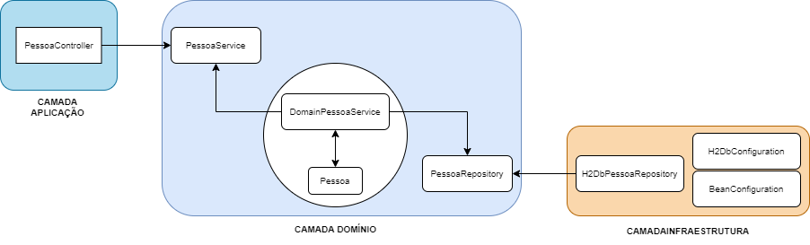

# Cadastro de Pessoa

### Referência para projetos usando Arquitetura limpa
Este projeto tem como objetivo demonstrar o conceito de "Arquitetura Limpa" implementando a Arquitetura Hexagonal, DDD _(Domain Driven Design)_ e Spring Framework.

**IMPORTANTE!!!**
Este projeto possui um débito técnico: a entidade de domínio **Pessoa** tem dependência do SpringData JPA, isto "fere" uma das premissas da Arquitetura Hexagonal, entidades de domínio não podem ter dependências. A solução é implementar um _Output port_ no qual conterá o mapeamento JPA desta entidade, o adaptador de persistência utiliza desta entidade mapeada.

### Executando o projeto
`mvn spring-boot:run`

### Executando os testes unitários
`mvn test`

### Documentação da API - Swagger
http://localhost:8080/swagger-ui.html

### Para acessar o Banco de dados
http://localhost:8080/h2-console/